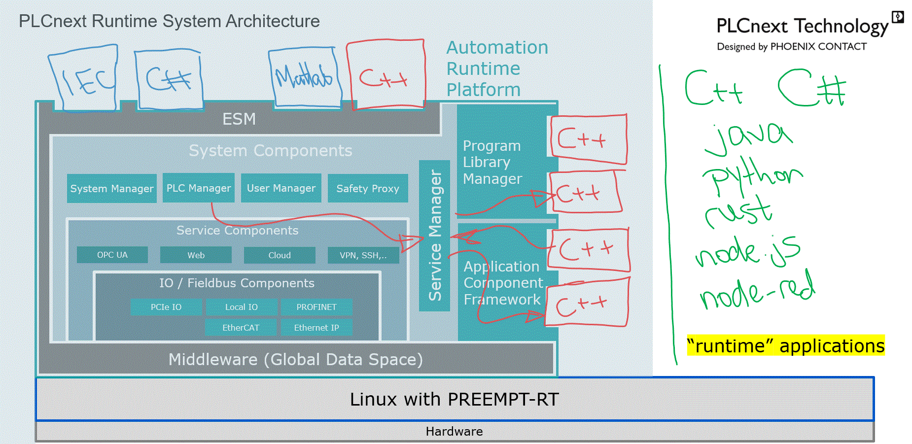
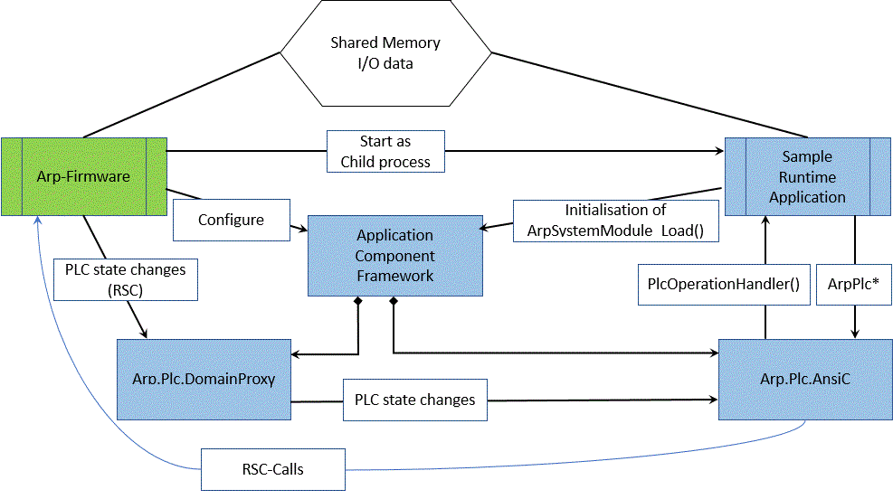

# PLCnext Technology  - SampleRuntime

## Guide details

|Description   | Value      |
|--------------|------------|
|Created       | 26.07.2019 |
|Last modified | 02.06.2021 |
|Controller    | AXC F 2152 |
|Firmware      | 2020.0 LTS |
|SDK           | 2020.0 LTS |

Hardware requirements

Starter kit- AXC F 2152 STARTERKIT - (Order number 1046568), consisting of:

1. I/O module AXL F DI8/1 DO8/1 1H (Order number 2701916).
1. I/O module AXL F AI2 AO2 1H (Order number 2702072).
1. Interface module UM 45-IB-DI/SIM8 (Order number 2962997).
1. Patch cable FL CAT5 PATCH 2,0 (Order number 2832289).

Host machine software requirements:

1. Linux operating system.
1. Software Development Kit (SDK) for at least one PLCnext Control target.

For steps involving the use of PLCnext Engineer:

1. Windows 10 operating system.
1. PLCnext Engineer version 2020.0.

## Introduction

The term "runtime" is used to describe a specific type of PLCnext application. PLCnext runtime applications usually provide an alternative to the real-time control components provided by the Automation Runtime Platform (ARP) - i.e. the Execution and Synchronisation Manager (ESM) and the Embedded Common Language Runtime (eCLR).

One example of a runtime application is [Codesys](https://www.plcnextstore.com/#/48) from 3S-Smart Software Solutions GmbH. Codesys is a popular PLC runtime that can be installed on PLCnext Control hardware as an alternative to the PLCnext runtime. 3S also provides an IDE for configuring the Codesys runtime, which is their equivalent to PLCnext Engineer.

This article provides a step by step guide to building your own runtime application for PLCnext Control. It concludes with an example of a complete "Sample Runtime" application.

## Runtime applications in the PLCnext system architecture

The [PLCnext Technology Info Center](http://plcnext-infocenter.s3-website.eu-central-1.amazonaws.com/PLCnext_Technology_InfoCenter/PLCnext_Technology_InfoCenter/Home.htm) includes the following architecture diagram. The location of runtime applications is indicated by the red rectangle.

Runtime applications are often the best solution for the following situations: 

- Porting existing software to a PLCnext Control.

- The development of new PLCnext Control applications in languages like Rust, Java, or Python.

For **new** PLCnext Control applications written in **C++**, it is recommended to use the Application Component Framework (ACF) to develop Components and Programs in a shared object library, which can be loaded directly by the Automation Runtime Platform (ARP) via the Program Library Manager (PLM) and utilise the real-time Execution and Synchronisation Manager (ESM). These types of applications are called "Extension Components". An example of how to configure a C++ program to run on the ESM, without using PLCnext Engineer, is given in the [CppExamples project](https://github.com/PLCnext/CppExamples/blob/master/Examples/NoEngineer/README.MD).

The Info Center includes [more information](http://plcnext-infocenter.s3-website.eu-central-1.amazonaws.com/PLCnext_Technology_InfoCenter/PLCnext_Technology_InfoCenter/Programming/Cpp/Cpp-programming.htm) on how C++ programs like runtime applications and function extensions interact with the PLCnext runtime.

## PLCnext Control - Runtime integration

Generally, runtime applications have the following requirements:
- Access to physical I/O modules.
- Access to PLC system services, e.g. reading PLC status information.
- The ability to run deterministic, real-time processes on the operating system.

Software that does not have any of the above requirements - including most general-purpose open-source software - can usually be cross-compiled for PLCnext Control without any modification, or even installed on a PLCnext Control using a pre-built binary for a compatible architecture (e.g. ARMv7). One example of this type of application is [Node.js](https://www.plcnextstore.com/#/47). While these types of applications share some common features with PLCnext runtime applications, this guide deals with applications that utilise features unique to PLCnext Control hardware and firmware.

In order for an external application to use the services and the shared memory of the ARP firmware, the application must be started by the PLCnext runtime, and it must also initialise part of the ACF. Due to the configuration of the ARP firmware, the application is started in a separate process.

In order to initialize the ACF, the application must call the `ArpSystemModule_Load` function. When the initialization is completed, a number of required components are started in the application process (e.g. `Arp.Plc.DomainProxy` and `Arp.Plc.AnsiC`). These components must be defined in the runtime configuration file.

When the startup phase is completed, a set of functions enables the application to communicate with the `Arp.Plc.AnsiC` component. The respective calls are translated into RSC calls to the ARP firmware. Any changes of the controller state are passed on to the application using a callback function.

Relationships between these dependencies are represented in the following diagram:

## Before getting started ...

Please note that the application developed in this series of articles uses:
- `C++`, but the same principles can be used to develop similar applications in most popular programming languages.
- `CMake` and `Ninja`, but other build systems can be used.
- `Bash` scripts, but other scripting languages can be used.
- Microsoft Visual Studio Code, but any editor or IDE can be used.
- A PLC with IP address 192.168.1.10, but any valid IP address can be used.

## Getting Started

In the following series of technical articles, you will build your own runtime application for PLCnext Control. Each article builds on tasks that were completed in earlier articles, so it is recommended to follow the series in sequence.

|\#| Topic | Objectives |
| --- | ------ | ------ |
|[01](getting-started/Part-01/README.md)| [Hello PLCnext](getting-started/Part-01/README.md)| Create a simple application in C++, and run it on a PLCnext Control.|
|[02](getting-started/Part-02/README.md)| [PLCnext Control integration](getting-started/Part-02/README.md)| Use the PLCnext Control to start and stop the application automatically. Create PLCnext ANSI-C component instances. Write messages to the application log file. |
|[03](getting-started/Part-03/README.md)| [Reading and writing Axioline I/O](getting-started/Part-03/README.md)| Use the PLCnext ANSI-C library to read digital inputs from an Axioline I/O module, write digital outputs, and read Axioline diagnostic data. |
|[04](getting-started/Part-04/README.md)| [Getting PLCnext Control status via callbacks](getting-started/Part-04/README.md)| Use notifications from the PLCnext Control to start and stop data exchange with Axioline I/O modules. |
|[05](getting-started/Part-05/README.md)| [Using RSC Services](getting-started/Part-05/README.md)| Use the "Device Status" RSC service to log the PLC board temperature. |
|[06](getting-started/Part-06/README.md)| [Creating real-time threads](getting-started/Part-06/README.md)| Perform cyclic I/O processing on a real-time thread, while non-real-time operations continue on another thread. |
|[07](getting-started/Part-07/README.md)| ["Sample Runtime" application](getting-started/Part-07/README.md)| Build and explore a complete runtime application which can be used as the starting point for professional PLCnext runtime projects. |
|[08](getting-started/Part-08/README.md)| [Configure Axioline I/O modules](getting-started/Part-08/README.md)| Parameterise an Axioline serial communication module, and read the configuration back from the module.|
|[09](getting-started/Part-09/README.md)| [Disable unnecessary system services](getting-started/Part-09/README.md)| Learn how to disable Profinet, Ethernet/IP™, HMI and/or OPC-UA services on the PLC.|
|[10](getting-started/Part-10/README.md)| [OPC UA](getting-started/Part-10/README.md)| Make data in the runtime application available through an OPC UA server.|
|| [Explore unlimited possibilities ...](getting-started/Part-99/README.md)| Get ideas for other interesting features you can implement in your own PLCnext runtime application.|

---

## How to get support

You can get support in the forum of the [PLCnext Community](https://www.plcnext-community.net/index.php?option=com_easydiscuss&view=categories&Itemid=221&lang=en).

---

Copyright © 2020 Phoenix Contact Electronics GmbH

All rights reserved. This program and the accompanying materials are made available under the terms of the [MIT License](http://opensource.org/licenses/MIT) which accompanies this distribution.
